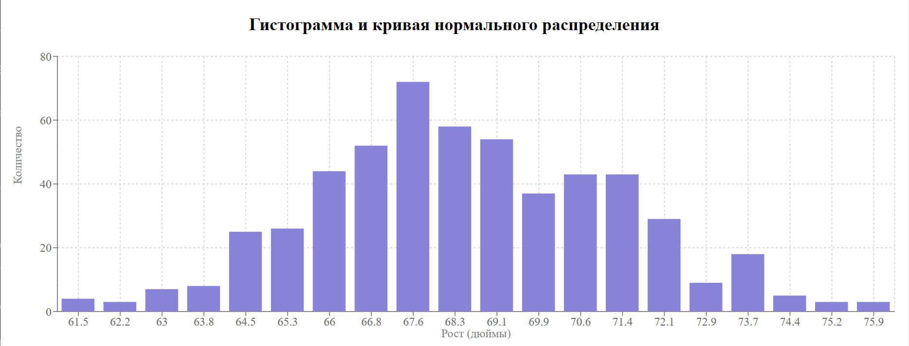
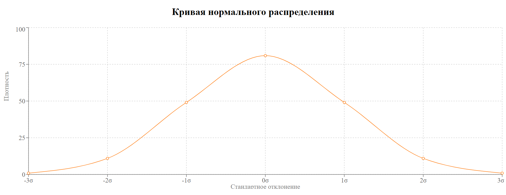
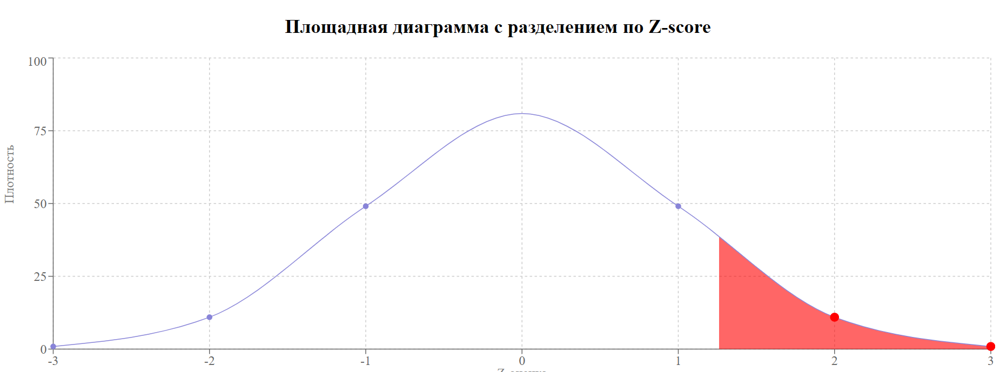

# Гистограмма и кривая нормального распределения

## Описание проекта

Этот проект демонстрирует гистограмму распределения данных и соответствующую кривую нормального распределения. Он был создан с использованием библиотеки [Recharts](https://recharts.org/) для визуализации данных и React для создания интерактивного пользовательского интерфейса.


---

## Гистограмма

Гистограмма показывает частотное распределение данных по определенным интервалам (бинам). В данном случае она отображает распределение роста людей (в дюймах).

### Особенности:
- **Ось X**: Рост (дюймы), значения округлены до одного знака после запятой.
- **Ось Y**: Количество людей, чей рост попадает в данный интервал.
- **Бины**: Данные разделены на 20 равных интервалов.



---

## Кривая нормального распределения

Кривая нормального распределения (кривая Гаусса) показывает теоретическое распределение данных вокруг среднего значения. Она строится на основе вычисленного среднего значения и стандартного отклонения.

### Особенности:
- **Ось X**: Стандартное отклонение (σ), значения меток оси представлены в виде -3σ, -2σ, ..., +3σ.
- **Ось Y**: Плотность вероятности.
- Кривая строится с использованием функции Гаусса:  
  \[
  f(x) = \frac{1}{\sigma \sqrt{2\pi}} e^{-\frac{(x-\mu)^2}{2\sigma^2}}
  \]



---

## Площадная диаграмма с Z-оценками

Площадная диаграмма показывает распределение данных относительно Z-оценок (стандартизованных значений). Она также подчеркивает выбросы, находящиеся за пределами двух стандартных отклонений.

### Особенности:
- **Ось X**: Z-оценка, значения меток оси представлены в виде -3, -2, ..., +3.
- **Ось Y**: Плотность вероятности.
- **Выделение выбросов**: Точки с Z-оценкой больше 2 отображаются красными маркерами.

### Значение красной области:
Красная область на графике указывает на то, что эти значения редко встречаются в нормальном распределении. Согласно свойствам нормального распределения:
- Около **68%** данных находится в пределах ±1 стандартного отклонения от среднего значения.
- Около **95%** данных находится в пределах ±2 стандартных отклонений.
- Около **99.7%** данных находится в пределах ±3 стандартных отклонений.

Таким образом, значения, попадающие в красную область (Z > 1), составляют примерно **32%** данных (100% - 68%). Это помогает выявить выбросы или аномалии в данных.



---

## Техническая реализация

### Используемые технологии:
- **React**: Для создания компонентов и управления состоянием.
- **Recharts**: Для визуализации данных.
- **JavaScript**: Для обработки данных и вычислений.

### Основные функции:
1. **Удаление выбросов**: Функция `removeOutliers` удаляет данные, находящиеся за пределами ±3 стандартных отклонений.
2. **Вычисление Z-оценок**: Значения данных стандартизируются относительно среднего значения и стандартного отклонения.
3. **Генерация данных для графиков**: Функция `processData` создает данные для гистограммы, кривой нормального распределения и площадной диаграммы.

---

## Запуск проекта

Чтобы запустить проект локально, выполните следующие шаги:

1. **Клонирование репозитория**:
   ```bash
   git clone https://github.com/Outlier-Zapper.git
   cd outlier-zapper
   ```

2. **Установка зависимостей**:
   ```bash
   npm install
   ```

3. **Запуск приложения**:
   ```bash
   npm start
   ```